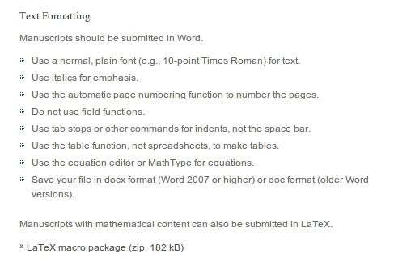

--- 
title       : Templates - Dissertações e Teses
subtitle    : Use seu tempo de forma eficiente!
author      : Comissão de Pós-Graduação, SVPG, Biblioteca, LGN, CeTI-LQ
job         : ESALQ/USP #Usar slidify
framework   : io2012        # {io2012, html5slides, shower, dzslides, ...}
highlighter : prettify  # {highlight.js, prettify, highlight}
hitheme     : solarized_light    # era tomorrow
linenums    : true
widgets     : [mathjax, bootstrap, quiz]   # {mathjax, quiz, bootstrap}
mode        : selfcontained # {standalone, draft}
--- 

## Introdução

- O que faz um estudante/cientista/professor?
- Atividade comum: estudar, ler, produzir conteúdo, *publicar*
- Gerenciamento de uma grande quantidade de informação e conhecimento
- Redação de conteúdo em diferentes formatos
  - Plano de Tese
  - Projeto FAPESP
  - Relatórios
  - Artigos
  - Dissertações e Teses (aluno, orientador, biblioteca, SVPG)
- Windows, Linux, Mac - Office, LibreOffice, LaTeX, ...
- Diversas regras em diferentes revistas, congressos, etc

---

## Exemplo 1

---

## Exemplo 2

### Theoretical and Applied Genetics

---

## Formatos para citações bibliográficas adotados pelas principais revistas

- [Citation Styles, CSL, http://citationstyles.org](http://citationstyles.org/)
  - Mais de 8000 estilos de citação (abertos e gratuitos)
  - As principais revistas participam e contribuem
  - Tais formatos podem ser importados em vários programas
  gerenciadores de referências

---

## Gerenciadores de Referências

  1. [Mendeley](http://www.mendeley.com/)
  2. [Zotero](https://www.zotero.org/)
  3. [EndNote](http://endnote.com/)
  4. [BibTeX](http://www.bibtex.org/)
  5. [Papers](http://www.papersapp.com/)
  6. [JabRef](http://jabref.sourceforge.net/)
  7. [citeulike](http://www.citeulike.org/)
  8. ... (a lista é longa!)

---

## Formato Atual

---

- Windows
- MS Word
- ABNT

--- bg:#fee6ce

# Novas Regras - Proposta

- Desenvolver templates que possam ser usados em diferentes cenários
- Multiplataforma (Windows, Mac, Linux)
- Word, LibreOffice, $LaTeX$, (Google Docs)
- Gerenciadores de Referências
- Tutoriais
- Fácil utilização

---

## Templates ("Modelos")

- Objetivo: eficiência e produtividade
- Uso dos modernos recursos computacionais
- Foco no conteúdo, não nos formatos e regras

---

# Template e tutorial no $LaTeX$

---

## Informações

---

## Arquivos

---

## Compile. Pronto!

---

## Ficha catalográfica (automaticamente!)

---

---

---

---

---

# Template e tutorial no Word

---

## Instale o template

---

---

---

## Altere configurações

- Tamanho da página
- Numeração

---

## Use os novos estilos disponíveis em seu documento

---

---

---

---

---

## Sumário: será feito automaticamente

---

## Template + Gerenciador de Referências

---

## Tutoriais em Vídeo

<iframe width="560" height="315" src="https://www.youtube.com/embed/fUO9bxkBWyU" frameborder="0" allowfullscreen></iframe>

---

## Tutoriais em Vídeo

<iframe width="560" height="315" src="https://www.youtube.com/embed/pdN-0KEPVHo" frameborder="0" allowfullscreen></iframe>

--- .segue .dark .quote

<q class = 'yellow'> Ajude-nos com críticas e sugestões (tutoriais,
vídeos, traduções, etc)! </q>

<q class = 'yellow'> OBRIGADO! </q>

